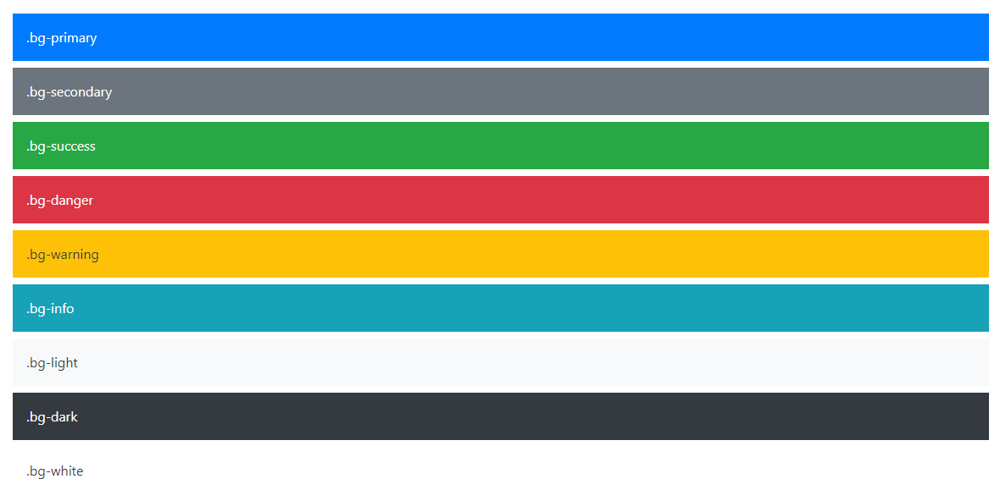
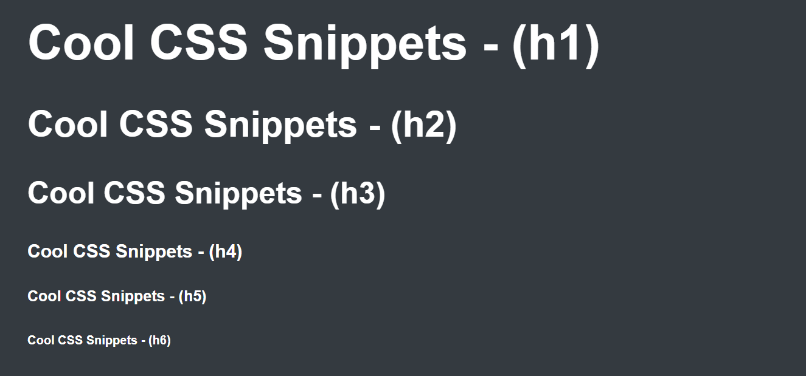

# Cool CSS Snippets
> This extension includes Snippets that you need to code very easily in css

| Command   |      What does that mean?     |
|----------|-------------|
| typo-head |  Full Responcive Heddings |
| typo-pera |    Full Responcive Paragraphs   |
| full-bg | Perfect Full Page Background |
| center-flex | Horizontally and vertically center div using flex |
| center-absolute | Horizontally and vertically center div using position absolute |
| root-bootstrap-colors | Add Boostrap Colors to variables (root) |
| root-google-fonts | Add google fonts to variables (root) |
| root-full | Create full root selector with variables |
| div.background | Add perefect background Image to div |
| media-min | Create media queries (min-width) |
| media-max | Create media queries (max-width) |
| split-style | Create a split between css styles |
| animation | Create a keyframe animation (0% - 100%) |
| More Comming soon | They will do more cool things |

 

## Bootstrap Colors

## Heddings

